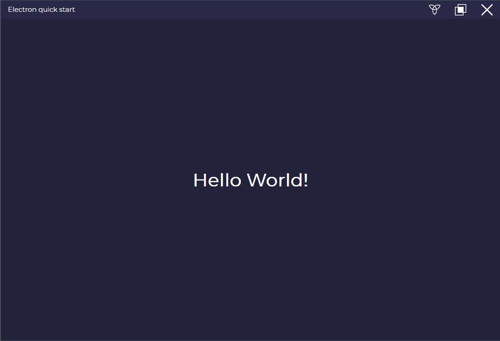

# template_for_electron_app

 

A simple starter template for future electron js python applications

 

## Description

---

You can run this with npm start as you would a electron application:
  

        npm start

To run python functions in js you would probably want to use python shell:

        npm install python-shell

Close icon made by <a href="https://www.flaticon.com/authors/pixel-perfect" title="Pixel perfect">Pixel perfect</a> from <a href="https://www.flaticon.com/" title="Flaticon">www.flaticon.com</a>

Maximize icon made by <a href="https://www.flaticon.com/authors/freepik" title="Freepik">Freepik</a> from <a href="https://www.flaticon.com/" title="Flaticon">www.flaticon.com</a>

Minimize icon made by <a href="https://www.flaticon.com/authors/freepik" title="Freepik">Freepik</a> from <a href="https://www.flaticon.com/" title="Flaticon">www.flaticon.com</a>

  

## Display

---

 

